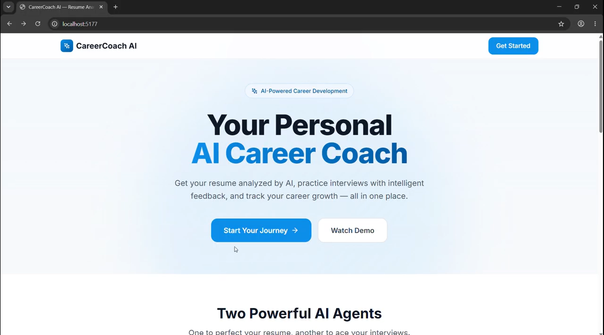
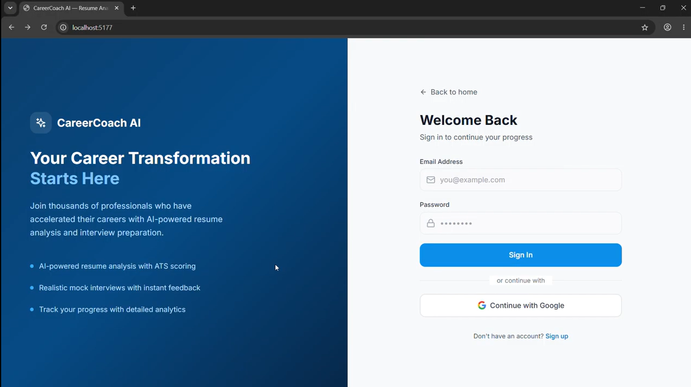
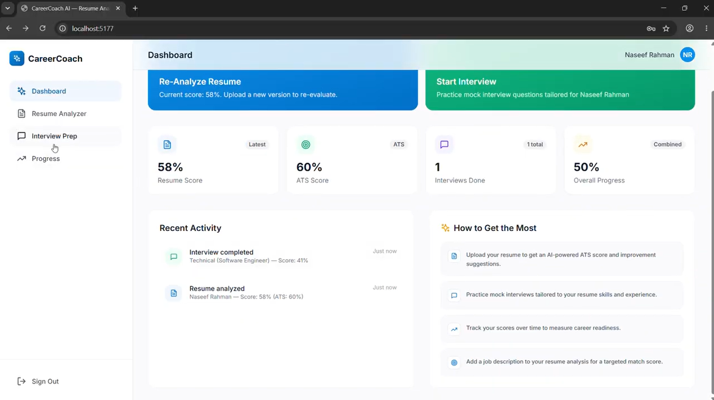
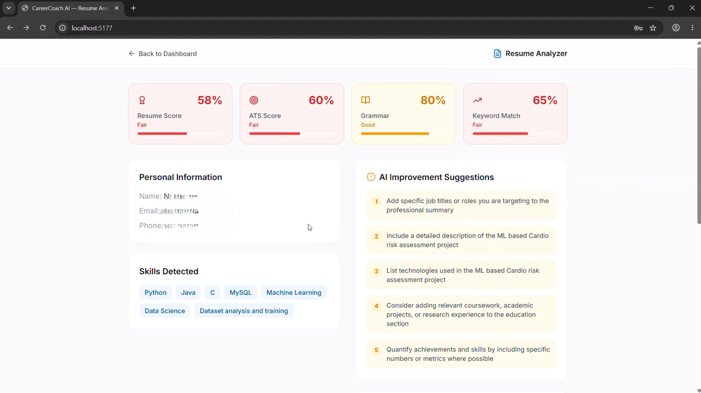
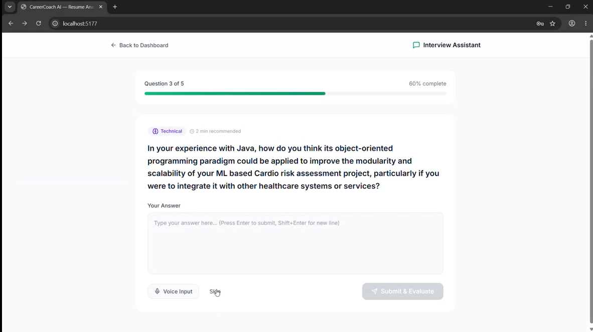
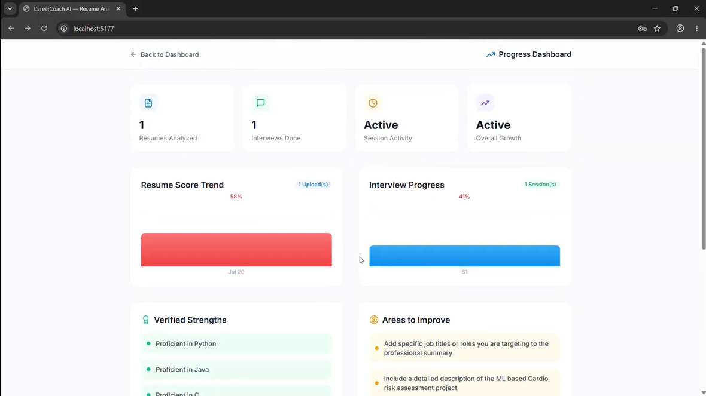

# 🤖 CareerCoach AI

> An AI-powered career coach that helps job seekers optimize their resumes, improve ATS scores, and practice AI-driven mock interviews.


---

## 📖 Overview

CareerCoach AI is an intelligent web application designed to assist job seekers throughout their career journey.

Instead of helping recruiters hire candidates, CareerCoach AI acts as a **personal AI career coach** by:

- 📄 Analyzing resumes using ATS standards
- 🎯 Matching resumes with job descriptions
- 💡 Providing AI-powered resume improvement suggestions
- 🎤 Conducting AI mock interviews
- 📈 Tracking user progress over time

---

# ✨ Features

## 📄 Resume Analyzer

- Upload Resume (PDF)
- Resume Parsing
- ATS Score Analysis
- Resume Score
- Grammar Evaluation
- Skill Extraction
- Experience Analysis
- Education Detection
- Project Identification
- Keyword Matching
- Resume Improvement Suggestions
- Job Description Matching

---

## 🎤 Interview Assistant

Practice interviews with an AI interviewer.

Features include:

- Technical Interview Questions
- HR Interview Questions
- AI-generated Follow-up Questions
- Instant Feedback
- Interview History
- Performance Analysis

---

## 📊 Progress Dashboard

Track your improvement over time.

- Resume Score History
- ATS Score History
- Practice Sessions
- Interview Performance
- Resume Upload History

---

# 🏗️ System Architecture

```text
                    User
                      │
              Login / Register
                      │
                      ▼
                 Dashboard
          ┌───────────┴────────────┐
          │                        │
          ▼                        ▼
 Resume Analyzer Agent     Interview Assistant Agent
          │                        │
          ▼                        ▼
    Resume Report          Mock Interview Session
          │                        │
          └───────────┬────────────┘
                      ▼
              Progress Dashboard
```

---

# 🚀 User Workflow

```text
Landing Page
      │
      ▼
Authentication
      │
      ▼
Dashboard
      │
 ┌────┴─────┐
 │          │
 ▼          ▼
Resume     Interview
Analyzer   Assistant
 │          │
 ▼          ▼
Report   Mock Interview
 │          │
 └────┬─────┘
      ▼
Progress Dashboard
```

---

# 📄 Resume Analyzer Workflow

```text
Upload Resume
      │
      ▼
Extract PDF Text
      │
      ▼
Identify Skills
      │
      ▼
Extract Education
      │
      ▼
Extract Experience
      │
      ▼
Identify Projects
      │
      ▼
Keyword Matching
      │
      ▼
ATS Score
      │
      ▼
AI Suggestions
      │
      ▼
Final Resume Report
```

---

# 📸 Application Screenshots

## 🏠 Landing Page



---

## 🔐 Login Page



---

## 📊 Dashboard



---

## 📄 Resume Analyzer Report



---

## 🎤 Interview Assistant



---

## 📈 Progress Dashboard



---

# 🛠️ Tech Stack

### Frontend

- React
- TypeScript
- Vite
- Tailwind CSS
- React Router

### AI

- Groq API
- Llama Models

### Resume Processing

- PDF Parsing
- ATS Analysis
- Keyword Matching

### Development

- ESLint
- npm

---

# 📁 Project Structure

```text
CareerCoach-AI/
│
├── screenshots/
│   ├── landing-page.png
│   ├── login.png
│   ├── dashboard.png
│   ├── resume-analyzer-report.png
│   ├── interview.png
│   └── progress-dashboard.png
│
├── src/
│   ├── components/
│   ├── pages/
│   ├── lib/
│   ├── App.tsx
│   └── main.tsx
│
├── public/
├── package.json
├── vite.config.ts
├── tsconfig.json
├── README.md
└── .gitignore
```

---

# ⚙️ Installation

Clone the repository

```bash
git clone https://github.com/YOUR_USERNAME/CareerCoach-AI.git
```

Navigate to the project

```bash
cd CareerCoach-AI
```

Install dependencies

```bash
npm install
```

Create a `.env` file

```env
VITE_GROQ_API_KEY=your_api_key
```

Start the development server

```bash
npm run dev
```

Build for production

```bash
npm run build
```

---

# 💡 Example AI Suggestion

Instead of

```text
Worked on AI Project
```

CareerCoach AI recommends

```text
Developed an AI chatbot that reduced response time by 40%, improving customer support efficiency.
```

---

# 🎯 Future Enhancements

- AI Cover Letter Generator
- Resume Builder
- Voice-based Mock Interviews
- LinkedIn Profile Analysis
- AI Career Roadmap
- Resume Version History
- Job Recommendation Engine
- Multi-language Support
- Dark Mode
- User Analytics Dashboard

---

# 🤝 Contributing

Contributions are welcome!

1. Fork the repository
2. Create your feature branch

```bash
git checkout -b feature-name
```

3. Commit your changes

```bash
git commit -m "Add new feature"
```

4. Push the branch

```bash
git push origin feature-name
```

5. Open a Pull Request

---

# 📄 License

This project is licensed under the MIT License.

---

# 👨‍💻 Authors

- **Muhammed Shiyas M**
- **Naseef Rahman Asharaf**

GitHub: https://github.com/MUHAMMED-SHIYAS-M

---

⭐ If you found this project useful, please consider giving it a star!
